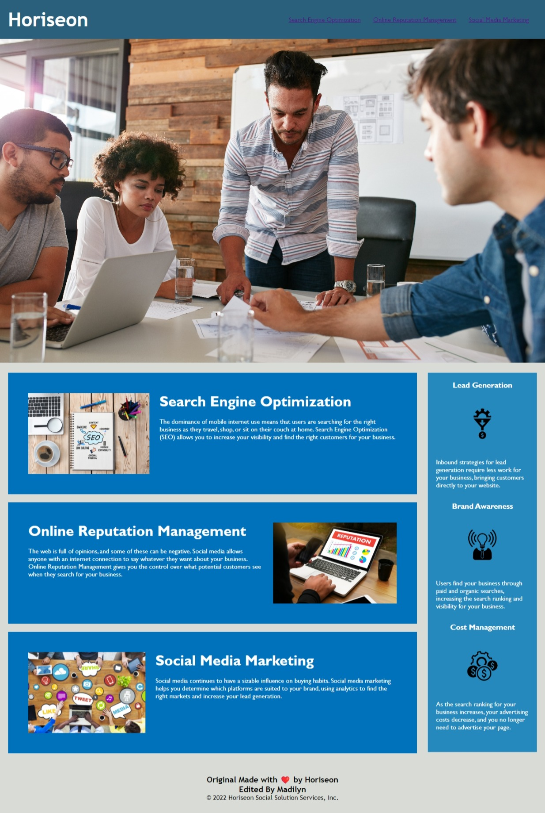

# Description
* First week challenge, Module 1 Challenge Due 12/22
for UW-VIRT-FSF-PT-12-2022-U-LOLC-MTTH

# Screenshot
* Live webpage

# GitHub Link
https://github.com/mcbariekman/accessibility-of-horiseon-mockup_module-1_week1challenge

# Acceptance 
* GIVEN a webpage meets accessibility standards
* WHEN I view the source code
* THEN I find semantic HTML elements
* WHEN I view the structure of the HTML elements
* THEN I find that the elements follow a logical structure independent of styling and positioning
* WHEN I view the image elements
* THEN I find accessible alt attributes
* WHEN I view the heading attributes
* THEN they fall in sequential order
* WHEN I view the title element
* THEN I find a concise, descriptive title